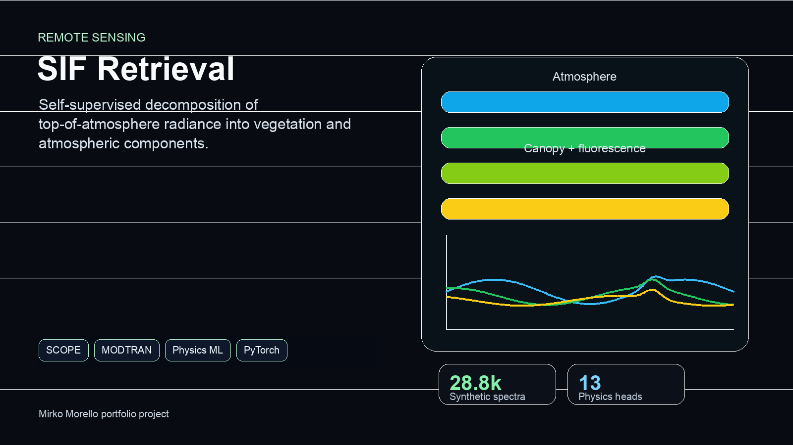

# Self-Supervised Neural Network for Solar-Induced Fluorescence Retrieval

> **MSc Thesis Project - Machine Learning for Modeling**
> **Author:** Mirko Morello
> **Institution:** Master of Science in Sensors and Imaging

<p align="center">
  
</p>

---

## Table of Contents

- [Overview](#overview)
- [Background](#background)
- [Motivation](#motivation)
- [Methodology](#methodology)
  - [1. Synthetic Dataset Generation](#1-synthetic-dataset-generation)
  - [2. Neural Network Architecture](#2-neural-network-architecture)
  - [3. Physics-Based Loss Functions](#3-physics-based-loss-functions)
- [Project Structure](#project-structure)
- [Technical Implementation](#technical-implementation)
  - [Data Generation Pipeline](#data-generation-pipeline)
  - [Network Architectures](#network-architectures)
  - [Training Process](#training-process)
- [Key Findings](#key-findings)
- [Installation](#installation)
- [Usage](#usage)
  - [Dataset Generation](#dataset-generation)
  - [Model Training](#model-training)
- [Technologies](#technologies)
- [References](#references)

---

## Overview

This project tackles one of the most challenging problems in remote sensing: **retrieving Solar-Induced Fluorescence (SIF)** from hyperspectral satellite imagery. SIF is a weak optical signal emitted by plants during photosynthesis and serves as a direct indicator of ecosystem health and carbon uptake. However, extracting this faint signal from top-of-atmosphere (TOA) satellite measurements is an **ill-posed inverse problem** complicated by atmospheric effects and surface reflectance.

Our solution employs a **self-supervised deep learning framework** that learns to decompose at-sensor radiance into its physical components without requiring extensive ground-truth SIF measurements. The key innovation is the use of a **dual Radiative Transfer Model (RTM)** setup—combining SCOPE and MODTRAN—to generate a physically realistic synthetic training dataset.

### Key Contributions

1. **Dual-RTM Synthetic Dataset**: Novel pipeline combining SCOPE (vegetation model) and MODTRAN (atmospheric model) to generate physically consistent training data
2. **Multi-Head Self-Supervised Architecture**: Neural network with specialized heads for each physical component ($R$, $F$, $t_1$ to $t_{11}$)
3. **Physics-Regularized Loss Functions**: Custom loss functions that enforce physical constraints and improve component separation

---

## Background

### Solar-Induced Fluorescence (SIF)

Solar-Induced Fluorescence is electromagnetic radiation emitted by chlorophyll molecules in plant leaves during photosynthesis. Unlike reflectance, which is passive scattering of sunlight, SIF provides a **direct window into plant physiological activity**.

**Why SIF Matters:**
- **Direct Photosynthesis Indicator**: SIF is directly linked to photosynthetic electron transport
- **Early Stress Detection**: Changes in SIF can indicate plant stress before visible damage occurs
- **Global Carbon Cycle**: Enables better estimates of Gross Primary Production (GPP)
- **Climate Monitoring**: Critical for understanding ecosystem responses to climate change

**The Challenge:**
SIF contributes only **1-5% of the total signal** measured by satellites at TOA. The dominant contributions come from:
- Surface reflectance ($R$): ~50-80%
- Atmospheric scattering and absorption (captured in transfer functions $t_1$ to $t_{11}$)
- Instrument noise and calibration errors

---

## Motivation

Traditional SIF retrieval methods rely on:
1. **Spectral Fitting Methods**: Fit physical models to absorption features (e.g., Fraunhofer lines, O₂-A band)
   - Pros: Physically grounded
   - Cons: Computationally expensive, sensitive to noise, requires accurate atmospheric correction

2. **Data-Driven Methods**: Use machine learning with ground-truth measurements
   - Pros: Fast, can handle complex relationships
   - Cons: Require extensive ground-truth data (scarce for SIF)

**Our Approach:**
We combine the best of both worlds:
- Use physics-based models (SCOPE + MODTRAN) to generate unlimited synthetic training data
- Employ self-supervised learning to avoid dependence on real ground-truth measurements
- Leverage the forward physical model $f_{forward}$ within the loss function to guide learning

This creates a framework that is:
- **Scalable**: Unlimited synthetic data generation
- **Physically Consistent**: Grounded in radiative transfer theory
- **Self-Supervised**: Learns from the physics, not labeled data alone

---

## Methodology

### 1. Synthetic Dataset Generation

The foundation of our approach is a comprehensive synthetic dataset generated using two state-of-the-art radiative transfer models.

#### SCOPE (Soil Canopy Observation, Photochemistry and Energy fluxes)

**Purpose**: Simulate vegetation canopy processes and generate surface-level outputs.

**Key Outputs:**
- **Reflectance** ($R$): Top-of-canopy reflectance spectrum (400-2400 nm)
- **Fluorescence** ($F$): Solar-induced fluorescence spectrum (640-850 nm)
- **$E_{sun}$**: Incoming solar irradiance at canopy level

**Varied Parameters:**
- **Leaf Optical Properties** (PROSPECT model):
  - $C_{ab}$: Chlorophyll content (20-50 μg/cm²)
  - $C_{ca}$: Carotenoid content (10 μg/cm²)
  - $C_{dm}$: Dry matter content (0.012 g/cm²)
  - $C_w$: Water content (0.009 cm)
  - $N$: Leaf structure parameter (1.5)

- **Canopy Structure**:
  - $\text{LAI}$: Leaf Area Index (0-8 m²/m²)
  - $h_c$: Canopy height (2 m)
  - $\text{LIDFa}$, $\text{LIDFb}$: Leaf angle distribution parameters

- **Biochemistry**:
  - $V_{cmax25}$: Maximum carboxylation rate (60 μmol/m²/s)
  - $f_{qe}$: Fluorescence quantum efficiency (0.01-2.0)

- **Environmental Conditions**:
  - $T_a$: Air temperature (20-30°C)
  - $R_{in}$: Incoming radiation (800 W/m²)
  - $C_a$: CO₂ concentration (410 ppm)

- **Observation Geometry**:
  - $\theta_s$: Solar zenith angle (0-60°)
  - $\theta_o$: Observer zenith angle (0°)
  - $\psi$: Relative azimuth angle (0°)

**Implementation**: `scopeWrapper.py` provides a Python interface to SCOPE (MATLAB-based).

#### MODTRAN (MODerate resolution atmospheric TRANsmission)

**Purpose**: Simulate atmospheric radiative transfer and generate atmospheric transfer functions.

**Key Outputs:**
- **$t_1$ to $t_{11}$**: Atmospheric transfer functions representing:
  - Direct solar transmission
  - Diffuse sky irradiance
  - Path radiance
  - Atmospheric scattering
  - Surface-atmosphere coupling terms

**Varied Parameters:**

*Atmospheric Composition:*
- $\text{O}_3$: Ozone concentration (0.03-0.06 atm-cm)
- $\text{NO}_2$: Nitrogen dioxide (0.01-0.03 atm-cm)
- $\text{CO}$: Carbon monoxide (0.1-0.7 atm-cm)
- $\text{H}_2\text{O}$: Water vapor content (1.5-2.5 cm)

*Aerosol Properties:*
- $\tau_{aer}$: Aerosol Optical Thickness (0.08-0.2)
- $\omega$: Single Scattering Albedo (0.95)
- $g$: Asymmetry factor (0.7)

*Cloud Conditions:*
- $f_{cloud}$: Sky coverage (0-0.6)
- $\tau_{cloud}$: Cloud optical depth (0-12)

*Geometry:*
- $\theta_s$: Solar zenith angle (matches SCOPE)
- $\theta_v$: Observer zenith angle
- $z_{gnd}$: Ground altitude (1 km)

**Atmospheric Scenarios**: We generated 20 different atmospheric conditions per SCOPE simulation, ranging from clear sky to moderately cloudy conditions with varying pollution levels.

#### Physical Forward Model (LTOA)

The outputs from SCOPE and MODTRAN are combined using the **four-stream radiative transfer equations** to compute Top-of-Atmosphere radiance:

$$
L_{TOA}(\lambda) = t_1 \cdot t_2 + \frac{t_1 \cdot (t_8 \cdot R + t_9 \cdot R + t_{10} \cdot R + t_{11} \cdot R) + t_6 \cdot F + t_7 \cdot F}{1 - t_3 \cdot R}
$$

Where:
- $\lambda$: Wavelength
- $R$: Surface reflectance
- $F$: Fluorescence
- $t_1$ to $t_{11}$: Atmospheric transfer functions from MODTRAN
- The denominator term $(1 - t_3 \cdot R)$ captures multiple scattering between surface and atmosphere

**Dataset Scale:**
- SCOPE and MODTRAN parameter sweeps covering vegetation, atmosphere, cloud, aerosol, and observation geometry scenarios
- **Total samples**: 28,800 synthetic LTOA spectra in the full experiment setup
- Spectral resolution: ~3,620 wavelength bands (650-850 nm)

**Files**:
- `dataset.py`: PyTorch Dataset classes for loading and preprocessing
- `main.ipynb`: Dataset generation workflow
- `output/simulation_*.parquet`: Individual simulation files
- `output/simulation_lookuptable.parquet`: Wavelength mappings

---

### 2. Neural Network Architecture

Our neural network is designed as a **multi-head encoder** that decomposes LTOA into its constituent physical components.

#### Architecture Overview

```
Input: LTOA + Metadata → [n_spectral + 3 channels]
         ↓
   Input Normalization (BatchNorm)
         ↓
   Shared Encoder Backbone
         ↓
   ┌─────┴─────┬─────┬─────┬─────┬─────┐
   ↓     ↓     ↓     ↓     ↓     ↓     ↓
  Head₁ Head₂ ... Head₉ Head₁₀ Head₁₁
   ↓     ↓     ↓     ↓     ↓     ↓     ↓
  t₁    t₂    ... t₉    R     F
         ↓
   ReLU (Non-negativity)
         ↓
   Forward Physical Model
         ↓
   LTOA_reconstructed
```

#### Input Features

**Spectral Channels** (~3,620):
- Top-of-atmosphere radiance spectrum (650-850 nm)

**Metadata Channels** (3):
- $x_{te}$: Cross-track extent = $\tan(\theta_v) \times z_{gnd}$
- $\theta_s$: Solar zenith angle
- $z_{gnd}$: Ground altitude

Total input dimension: 3,623 features per pixel

#### Shared Encoder Backbone

A deep fully-connected network that extracts common features:

```python
Input (3623)
    → Linear(3623 → 8192) + BatchNorm + ReLU + Dropout(0.1)
    → Linear(8192 → 8192) + BatchNorm + ReLU + Dropout(0.1)
    → Linear(8192 → 8192) + BatchNorm + ReLU + Dropout(0.1)
    → Features (8192)
```

**Design Choices:**
- **Large hidden dimensions (8192)**: Necessary to capture complex spectral relationships
- **BatchNorm**: Stabilizes training with high-dimensional inputs
- **Dropout (0.1)**: Prevents overfitting on synthetic data
- **ReLU activation**: Introduces non-linearity, helps with gradient flow

#### Output Heads

**11 Specialized Heads:**
- 9 heads for atmospheric transfer functions ($t_1, t_2, t_3, t_6, t_7, t_8, t_9, t_{10}, t_{11}$): Each outputs 3,620 values (full spectrum)
- 1 head for Reflectance ($R$): Outputs 3,620 spectral values
- 1 head for Fluorescence ($F$): Outputs 3,620 spectral values

Each head:
```python
Linear(8192 → 3620) + ReLU
```

**Why Separate Heads?**
- Allows each head to **specialize** in predicting its specific physical quantity
- Reduces interference between learning different components
- Enables targeted loss weighting and regularization per component

#### Network Variants

**1. SFMNNEncoderWithHeadsSingle** (Primary Model):
- Single-pixel processing
- Input: [B, 3623]
- Output: [B, 11, 3620]
- Best performance for our task

**2. ImprovedSFMNNEncoderWithHeadsResidual**:
- Adds residual connections between layers
- More stable gradient flow
- Slightly better performance on complex scenes

**3. SFMNNEncoderWithHeads** (Patch-based):
- Processes spatial patches (5×5 pixels)
- Input: [B, 3623, 5, 5]
- Exploits spatial correlations (for future work with real imagery)

**Files**: `network.py` contains all architecture implementations

---

### 3. Physics-Based Loss Functions

A critical innovation is our multi-term loss function that combines self-supervised learning with physics-based regularization.

#### Loss Components

**1. Self-Supervised Reconstruction Loss** ($\mathcal{L}_{recon}$)

The core self-supervised term:

$$
\mathcal{L}_{recon} = \text{MSE}(L_{TOA}^{pred}, L_{TOA}^{target})
$$

Where $L_{TOA}^{pred}$ is reconstructed from the network's predictions:

$$
L_{TOA}^{pred} = f_{forward}(t_1^{pred}, ..., t_{11}^{pred}, R^{pred}, F^{pred})
$$

This loss alone would allow the network to learn, but provides **very weak gradients** for $F$ (fluorescence) since it contributes only ~1-5% to $L_{TOA}$.

**2. Component-wise MSE Losses**

Direct supervision on individual components (enabled by synthetic data):

$$
\begin{align}
\mathcal{L}_t &= \text{MSE}(\mathbf{t}^{pred}, \mathbf{t}^{target}) \quad \text{(9 atmospheric terms)} \\
\mathcal{L}_R &= \text{MSE}(R^{pred}, R^{target}) \quad \text{(Reflectance)} \\
\mathcal{L}_F &= \text{MSE}(F^{pred}, F^{target}) \quad \text{(Fluorescence - critical!)}
\end{align}
$$

**Why this helps:**
- Provides **strong direct gradient** to the fluorescence head
- Breaks the degeneracy of the inverse problem
- Acts as a physical regularizer

**3. NDVI-Based Physiological Constraint** ($\mathcal{L}_{NDVI}$)

Plants with low vigor (low NDVI) should not exhibit high fluorescence:

$$
\text{NDVI} = \frac{R_{NIR} - R_{RED}}{R_{NIR} + R_{RED}}
$$

$$
\mathcal{L}_{NDVI} = \mathbb{E}\left[\text{ReLU}(F^{pred}) \cdot \mathbb{1}_{\{\text{NDVI} < \tau\}}\right]
$$

where $\mathbb{1}_{\{\text{NDVI} < \tau\}}$ is an indicator function for low NDVI regions (threshold $\tau = 0.15$).

This penalizes predicted fluorescence in regions where vegetation is sparse or unhealthy.

**4. Physics-Based LTOA Reconstruction** ($\mathcal{L}_{phys}$)

An alternative formulation that directly uses the forward model:

$$
\mathcal{L}_{phys} = \text{MSE}\left(f_{forward}(\text{predictions}), L_{TOA}^{target}\right)
$$

Ensures the predicted components satisfy the physics equations.

#### Combined Loss Function

$$
\mathcal{L}_{total} = \lambda_{recon} \cdot \mathcal{L}_{recon} + \lambda_t \cdot \mathcal{L}_t + \lambda_R \cdot \mathcal{L}_R + \lambda_F \cdot \mathcal{L}_F + \lambda_{NDVI} \cdot \mathcal{L}_{NDVI} + \lambda_{phys} \cdot \mathcal{L}_{phys}
$$

**Loss Weights** (tuned hyperparameters):
- $\lambda_{recon} = 0.1$ (lower weight since it's implicitly included in $\mathcal{L}_{phys}$)
- $\lambda_t = 1.0$
- $\lambda_R = 1.0$
- $\lambda_F = 1.0$ (critical component)
- $\lambda_{NDVI} = 1.0$
- $\lambda_{phys} = 1.0$

**Files**: `loss.py` implements all loss functions

---

## Project Structure

```
MSc_Sensors_Imaging/
│
├── Final_Project/                 # Main project directory
│   ├── dataset.py                 # Dataset loading and preprocessing
│   ├── network.py                 # Neural network architectures
│   ├── loss.py                    # Loss function implementations
│   ├── simulate.py                # Four-stream radiative transfer simulator
│   ├── scopeWrapper.py            # Python wrapper for SCOPE model
│   │
│   ├── main.ipynb                 # Dataset generation workflow
│   ├── train.ipynb                # Model training and evaluation
│   ├── dataset.ipynb              # Dataset exploration and visualization
│   ├── test.ipynb                 # Model testing and inference
│   │
│   ├── SCOPE/                     # SCOPE radiative transfer model
│   │   ├── README.md              # SCOPE documentation
│   │   └── ...                    # SCOPE source code (MATLAB)
│   │
│   ├── Modtran/                   # MODTRAN configuration files
│   │   └── README.txt
│   │
│   ├── synthetic_dataset/         # Generated SCOPE outputs
│   │   └── results.parquet
│   │
│   └── output/                    # Final combined simulations
│       ├── simulation_sim_*_amb_*.parquet  # Individual samples
│       └── simulation_lookuptable.parquet  # Wavelength mappings
│
├── README.md                      # This file
├── LICENSE                        # License information
└── .gitignore
```

---

## Technical Implementation

### Data Generation Pipeline

**Step 1: SCOPE Simulations** (`main.ipynb`)

```python
from scopeWrapper import SCOPEWrapperMultiRun

# Define parameter ranges
multi_params = {
    "Cab": [20.0, 25.0, 30.0, 40.0, 50.0],
    "LAI": [0.0, 2.0, 3.0, 5.0, 8.0],
    "fqe": [0.01, 0.03, 0.06, 0.1, 0.2, 0.5, 1.0, 2.0],
    "Ta": [20.0, 30.0],
    "tts": [0.0, 35.0, 60.0],
    # ... more parameters
}

# Run SCOPE
with SCOPEWrapperMultiRun(spectral_files={...}) as scope:
    results_path = scope.run(multi_params, setoptions, save_parquet=True)
```

**Step 2: MODTRAN Simulations** (`main.ipynb` - lower cells)

For each SCOPE simulation, run 20 MODTRAN scenarios:

```python
# Configure MODTRAN parameters
PARMS = {
    'ATM': {
        'SZA': solar_zenith_angle,
        'O3': ozone_level,
        'AOT': aerosol_optical_thickness,
        # ... atmospheric parameters
    },
    'SPECTRAL': {...},
    'GEOM': {...}
}

# Run MODTRAN via MATLAB
wvlLUT, T14 = run_modtran_matlab(PARMS, output_dir, case_name)
```

**Step 3: Combine and Compute LTOA**

```python
# Interpolate SCOPE outputs to MODTRAN wavelengths
R = interpolate_and_combine(wl_scope, reflectance_scope, wl_modtran)
F = interpolate_and_combine(wl_scope, fluorescence_scope, wl_modtran)

# Extract atmospheric transfer functions
t_vals = {f't{j}': T14[:, j-1] for j in range(1, 13)}

# Compute LTOA using four-stream equations
LTOA = compute_ltoa(t_vals, R, F)

# Save to Parquet
save_simulation(case_name, LTOA, t_vals, R, F, metadata)
```

### Network Architectures

**Loading the Model:**

```python
from network import SFMNNEncoderWithHeadsSingle

# Initialize model
model = SFMNNEncoderWithHeadsSingle(
    input_channels=3623,      # n_spectral + 3 metadata
    num_variables=11,         # t1-t11, R, F outputs
    encoded_dim=8192,         # Shared encoder dimension
    out_dim=3620              # Output spectral dimension
)

# Move to GPU
device = torch.device('cuda' if torch.cuda.is_available() else 'cpu')
model = model.to(device)
```

**Model Summary:**
- Parameters: ~300M (primarily in output heads: $11 \times 8192 \times 3620$)
- Memory footprint: ~1.2 GB
- Forward pass time: ~50ms per batch (batch_size=32, GPU)

### Training Process

**Dataset Preparation:**

```python
from dataset import SFMNNDatasetSingleWithTargets
from torch.utils.data import DataLoader, random_split

# Load dataset
dataset = SFMNNDatasetSingleWithTargets(
    lookup_table='output/simulation_lookuptable.parquet',
    data_folder='output/',
    out_dim_hint=3620
)

# Split train/val/test
train_size = int(0.7 * len(dataset))
val_size = int(0.15 * len(dataset))
test_size = len(dataset) - train_size - val_size
train_dataset, val_dataset, test_dataset = random_split(
    dataset, [train_size, val_size, test_size]
)

# Create dataloaders
train_loader = DataLoader(train_dataset, batch_size=32, shuffle=True)
val_loader = DataLoader(val_dataset, batch_size=32, shuffle=False)
```

**Training Loop** (`train.ipynb`):

```python
from loss import PhysicsRegularizedLoss
import torch.optim as optim

# Initialize loss and optimizer
criterion = PhysicsRegularizedLoss(
    lambda_t=1.0,
    lambda_r=1.0,
    lambda_f=1.0,
    lambda_phys_ltoa=1.0
)
optimizer = optim.Adam(model.parameters(), lr=1e-4, weight_decay=1e-5)
scheduler = optim.lr_scheduler.ReduceLROnPlateau(optimizer, patience=5)

# Training loop
for epoch in range(num_epochs):
    model.train()
    for batch in train_loader:
        input_tensor, target_11t, target_r, target_f, target_ltoa = batch

        # Forward pass
        predictions = model(input_tensor)  # [B, 11, 3620]

        # Split predictions
        pred_9t = predictions[:, :9, :]    # t1-t3, t6-t11
        pred_r = predictions[:, 9, :]      # Reflectance
        pred_f = predictions[:, 10, :]     # Fluorescence

        # Unnormalize predictions
        pred_9t_unnorm = dataset.unnormalize_t(pred_9t)
        pred_r_unnorm = dataset.unnormalize_r(pred_r)
        pred_f_unnorm = dataset.unnormalize_f(pred_f)

        # Compute loss
        loss, loss_dict, ltoa_recon = criterion(
            pred_9t_unnorm, pred_r_unnorm, pred_f_unnorm,
            target_11t, target_r, target_f, target_ltoa
        )

        # Backward pass
        optimizer.zero_grad()
        loss.backward()
        torch.nn.utils.clip_grad_norm_(model.parameters(), max_norm=1.0)
        optimizer.step()

    # Validation
    val_loss = validate(model, val_loader, criterion, dataset)
    scheduler.step(val_loss)
```

**Training Configuration:**
- Optimizer: Adam (lr=1e-4, weight_decay=1e-5)
- Scheduler: ReduceLROnPlateau (patience=5, factor=0.5)
- Gradient clipping: max_norm=1.0
- Batch size: 32
- Epochs: 100-200 (with early stopping)
- Hardware: NVIDIA GPU (16GB+ recommended)

---

## Key Findings

### What Worked

1. **LTOA Reconstruction**: The network learns a physically consistent reconstruction objective for $L_{TOA}$ from predicted components

2. **Reflectance Retrieval**: Surface reflectance ($R$) is much easier to recover than fluorescence because it dominates the measured signal

3. **Failure Analysis**: The experiments make the degeneracy of self-supervised SIF retrieval explicit, especially when true fluorescence is weak

### What Failed / Remains Open

1. **Fluorescence Overshooting**: The network tends to **overestimate fluorescence** ($F$), particularly when true $F$ is low
   - Root cause: Ill-posed nature of the inverse problem
   - Multiple combinations of $R$, $F$, and $\mathbf{t}$ can produce similar $L_{TOA}$
   - The weak $F$ signal (~1-5%) provides insufficient gradient

2. **Component Degeneracy**: The self-supervised loss alone cannot uniquely determine $F$
   - Some error in $F$ can be compensated by adjusting $R$ or atmospheric terms
   - This is a **fundamental limitation** of purely self-supervised approaches for this problem

3. **Sensitivity to Initialization**: Model performance varies with random weight initialization
   - Suggests multiple local minima in the loss landscape

### Insights

- **Synthetic Data is Essential**: Without ground-truth $F$, we cannot evaluate or regularize predictions
- **Physics-Based Losses Help**: Direct MSE on $F$ (i.e., $\mathcal{L}_F$) significantly improves retrieval compared to reconstruction loss alone
- **The Inverse Problem is Hard**: Even with perfect synthetic data, the ill-posed nature limits accuracy
- **Future Directions**:
  - Incorporate spectral priors (e.g., known $F$ emission shape)
  - Use multi-task learning with auxiliary outputs (e.g., vegetation indices)
  - Explore uncertainty quantification to flag unreliable predictions

---

## Installation

### Prerequisites

- Python 3.8+
- MATLAB R2020a+ (for SCOPE)
- MODTRAN 5 (licensed software)
- CUDA-capable GPU (recommended, 16GB+ VRAM)

### Python Dependencies

```bash
# Clone repository
git clone https://github.com/MirkoMorello/MSc_Sensors_Imaging.git
cd MSc_Sensors_Imaging/Final_Project

# Create virtual environment
python -m venv venv
source venv/bin/activate  # On Windows: venv\Scripts\activate

# Install dependencies
pip install torch torchvision torchaudio --index-url https://download.pytorch.org/whl/cu118
pip install numpy pandas scipy matplotlib tqdm
pip install pyarrow  # For Parquet file support
pip install jupyter notebook
pip install matlab-engine  # Requires MATLAB installation
```

### SCOPE Setup

```bash
# SCOPE is included in Final_Project/SCOPE/
# Ensure MATLAB is in your PATH
# Test SCOPE installation:
cd Final_Project/SCOPE
matlab -batch "SCOPE"
```

### MODTRAN Setup

MODTRAN requires a commercial license. Contact Spectral Sciences Inc. for licensing.

Once installed, update paths in `main.ipynb`:
```python
MODTRAN_DIR = Path("/path/to/your/MODTRAN5").resolve()
```

---

## Usage

### Dataset Generation

**Step 1: Generate SCOPE Simulations**

Open and run `Final_Project/main.ipynb` (cells 1-3):

```bash
jupyter notebook Final_Project/main.ipynb
```

This produces: `Final_Project/synthetic_dataset/results.parquet`

**Step 2: Run MODTRAN and Combine**

Continue in `main.ipynb` (cell 4+):
- Runs MODTRAN for 20 atmospheric scenarios per SCOPE sim
- Interpolates and combines outputs
- Computes LTOA using four-stream equations
- Saves to `Final_Project/output/simulation_sim_*_amb_*.parquet`

**Output Files:**
- `simulation_sim_0_amb_0.parquet` to `simulation_sim_N_amb_19.parquet`: Individual samples
- `simulation_lookuptable.parquet`: Wavelength grids

### Model Training

**Train the Model:**

Open and run `Final_Project/train.ipynb`:

```bash
jupyter notebook Final_Project/train.ipynb
```

**Key Steps:**
1. Load dataset
2. Split train/val/test
3. Initialize model and loss
4. Train for 100-200 epochs
5. Save best model checkpoint

**Monitor Training:**
```python
# In train.ipynb, loss components are logged per epoch:
# - mse_t9: MSE on 9 atmospheric terms
# - mse_r: MSE on reflectance
# - mse_f: MSE on fluorescence
# - phys_ltoa: Physics-based LTOA reconstruction error
```

**Model Checkpoints:**
```python
# Save best model
torch.save({
    'epoch': epoch,
    'model_state_dict': model.state_dict(),
    'optimizer_state_dict': optimizer.state_dict(),
    'loss': best_loss,
}, 'best_model.pth')
```

### Inference

**Load Trained Model:**

```python
import torch
from network import SFMNNEncoderWithHeadsSingle
from dataset import SFMNNDatasetSingleWithTargets

# Load model
model = SFMNNEncoderWithHeadsSingle(input_channels=3623, num_variables=11,
                                     encoded_dim=8192, out_dim=3620)
checkpoint = torch.load('best_model.pth')
model.load_state_dict(checkpoint['model_state_dict'])
model.eval()

# Load dataset (for normalization parameters)
dataset = SFMNNDatasetSingleWithTargets(
    lookup_table='output/simulation_lookuptable.parquet',
    data_folder='output/'
)

# Predict on test sample
with torch.no_grad():
    input_tensor, target_11t, target_r, target_f, target_ltoa = dataset[0]
    predictions = model(input_tensor.unsqueeze(0))

    # Unnormalize
    pred_f_unnorm = dataset.unnormalize_f(predictions[0, 10, :])

# Compare with ground truth
import matplotlib.pyplot as plt
plt.plot(dataset.get_wl(), pred_f_unnorm.cpu(), label='Predicted F')
plt.plot(dataset.get_wl(), target_f.cpu(), label='True F')
plt.xlabel('Wavelength (nm)')
plt.ylabel('Fluorescence')
plt.legend()
plt.show()
```

---

## Technologies

### Radiative Transfer Models
- **SCOPE 2.0**: Vegetation RTM (Van der Tol et al., 2009; Yang et al., 2021)
- **MODTRAN 5**: Atmospheric RTM (Spectral Sciences Inc.)

### Deep Learning
- **PyTorch 2.0**: Neural network framework
- **CUDA**: GPU acceleration

### Data Processing
- **NumPy**: Numerical computing
- **Pandas**: Data manipulation
- **PyArrow**: Fast Parquet I/O
- **SciPy**: Scientific computing (interpolation)

### Visualization
- **Matplotlib**: Plotting
- **Seaborn**: Statistical visualization

### Development
- **Jupyter**: Interactive notebooks
- **MATLAB Engine**: Python-MATLAB interface
- **Git**: Version control

---

## References

### Scientific Publications

1. **SCOPE Model**:
   - Yang, P., Prikaziuk, E., Verhoef, W., and Van der Tol, C. (2021). "SCOPE 2.0: a model to simulate vegetated land surface fluxes and satellite signals." *Geoscientific Model Development*, 14, 4697–4712. https://doi.org/10.5194/gmd-14-4697-2021
   - Van der Tol, C., Verhoef, W., Timmermans, J., Verhoef, A., and Su, Z. (2009). "An Integrated Model of Soil-Canopy Spectral Radiances, Photosynthesis, Fluorescence, Temperature and Energy Balance." *Biogeosciences*, 6(12), 3109–29. https://doi.org/10.5194/bg-6-3109-2009

2. **MODTRAN**:
   - Berk, A., et al. (2014). "MODTRAN6: A major upgrade of the MODTRAN radiative transfer code." *Proceedings of SPIE*, 9088. https://doi.org/10.1117/12.2050433

3. **SIF Retrieval**:
   - Frankenberg, C., et al. (2011). "New global observations of the terrestrial carbon cycle from GOSAT: Patterns of plant fluorescence with gross primary productivity." *Geophysical Research Letters*, 38(17). https://doi.org/10.1029/2011GL048738
   - Guanter, L., et al. (2014). "Retrieval and global assessment of terrestrial chlorophyll fluorescence from GOSAT space measurements." *Remote Sensing of Environment*, 121, 236-251. https://doi.org/10.1016/j.rse.2012.02.006

4. **Deep Learning for Remote Sensing**:
   - Verrelst, J., et al. (2019). "Quantifying Vegetation Biophysical Variables from Imaging Spectroscopy Data: A Review on Retrieval Methods." *Surveys in Geophysics*, 40, 589–629. https://doi.org/10.1007/s10712-018-9478-y

### Software Documentation

- SCOPE Model: https://scope-model.readthedocs.io/
- PyTorch: https://pytorch.org/docs/
- MODTRAN: https://www.spectral.com/modtran/

---

## License

This project is licensed under the terms specified in the [LICENSE](LICENSE) file.

---

## Acknowledgments

This work was completed as part of the MSc program in Sensors and Imaging. Special thanks to:
- The SCOPE development team for the open-source radiative transfer model
- Spectral Sciences Inc. for MODTRAN
- Academic advisors and reviewers for their guidance

---

## Contact

**Author**: Mirko Morello
**GitHub**: https://github.com/MirkoMorello
**Project Repository**: https://github.com/MirkoMorello/MSc_Sensors_Imaging

For questions or collaboration inquiries, please open an issue on GitHub.

---

**Last Updated**: November 2025
