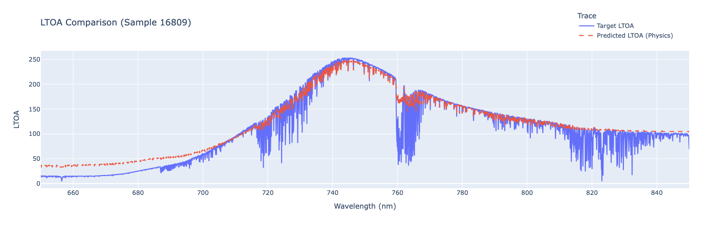
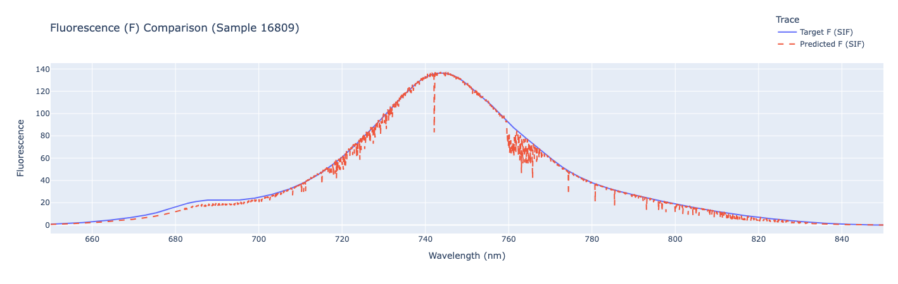

# Neural Retrieval of Solar-Induced Fluorescence from Synthetic Spectra


A self-supervised neural network that tries to disentangle solar-induced
fluorescence (SIF), reflectance and atmospheric parameters from
top-of-atmosphere radiance, trained on a synthetic dataset built by
coupling the SCOPE and MODTRAN radiative transfer models. The network
reconstructs the observed radiance well, but the study's honest finding is
that recovering the individual physical components — fluorescence in
particular — is an ill-posed inverse problem that direct supervision on
synthetic data does not fully solve.

Final project for the **Physical Sensors and Systems for Environmental
Signals (Imaging)** course, MSc in Artificial Intelligence (University of
Milano-Bicocca), with Andrea Yachaya.

<p align="center"></p>
<p align="center"><em>Top-of-atmosphere radiance: target vs the spectrum
reconstructed from the network's predicted components. Reconstruction is
accurate. Source: report, Fig. 2.</em></p>

## Results

- **LTOA reconstruction**: the model reproduces the top-of-atmosphere
  radiance spectrum closely (Fig. 2).
- **Component retrieval**: fluorescence prediction systematically
  overshoots at low target values — the network prioritises the rare
  high-SIF examples where the reconstruction error is largest (Fig. 3).
  Reflectance and the 11 atmospheric parameters show similar discrepancies.
- **Diagnosis**: the inverse problem is ill-posed — multiple combinations
  of fluorescence, reflectance and atmosphere yield near-identical radiance
  — and the synthetic dataset's parameter ranges include unrealistically
  high fluorescence values that skew training. No held-out metric is
  reported; the analysis is qualitative, per the report.

## Approach

- **Data**: SCOPE simulates reflectance and fluorescence across vegetation
  and canopy conditions; MODTRAN adds atmospheric radiative transfer; the
  two are combined into top-of-atmosphere radiance spectra.
- **Model**: a multi-head encoder predicting fluorescence (F), reflectance
  (R) and atmospheric parameters (t), trained to reconstruct the observed
  radiance (self-supervised) with optional physics-based regularizers.
- **Loss variants** (`loss.py`): plain reconstruction (`SFMNNLoss`), an
  enhanced version adding direct MSE on F plus an NDVI penalty and L1 SIF
  regularization, and `PhysicsRegularizedLoss` adding MSE on R and t.

<p align="center"></p>
<p align="center"><em>Fluorescence prediction vs target: the network tracks
the peak but drifts at lower values — the core difficulty of the retrieval.
Source: report, Fig. 3.</em></p>

## How to run

```sh
pip install torch numpy scipy matplotlib plotly jupyter
jupyter lab Final_Project/dataset.ipynb   # build the SCOPE+MODTRAN dataset
jupyter lab Final_Project/main.ipynb      # train and evaluate
```

Model in `Final_Project/model.py` / `network.py`, losses in
`Final_Project/loss.py`. The SCOPE simulator is vendored under
`Final_Project/SCOPE/`.

## Report

Full write-up: [Final_report_Morello_Yachaya.pdf](Final_Project/Final_report_Morello_Yachaya.pdf)
— Mirko Morello, Andrea Yachaya.
